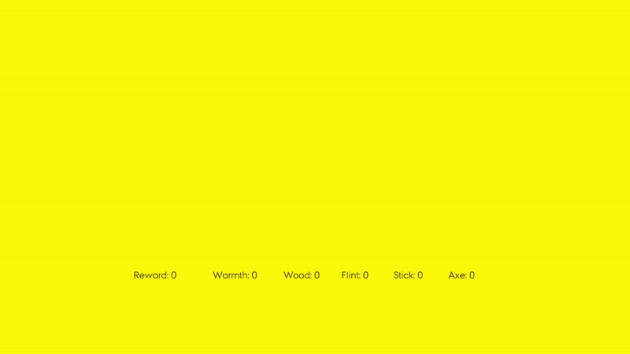

# MiniAdventureML

MiniAdventureML is a Unity project developed as part of a Games thesis at the I.T. University of Copenhagen. It explores the application of ML-Agents in a mini survival game, where the agent must gather resources and craft tools to survive. This project was created in collaboration with [Hysse](https://github.com/Hysse).

## Overview

MiniAdventureML is a research-driven project designed to explore how machine learning, specifically reinforcement learning through ML-Agents, can be applied to a survival game scenario. The agent's task is collect flint and sticks to craft an axe, which is then used to chop down trees and gather enough logs to build a fire. The challenge is to complete these tasks before the agent dies from exposure to the cold.

## Features

- **Visual Customization**: The `BoardVisualsDictionary` class allows for easy adjustment of all in-game visuals using Scriptable Objects. This makes it simple to change the appearance of tiles.

- **Customizable Rewards**: The `RewardController` class provides the ability to set and fine-tune the rewards for different actions within the game.

- **Game Settings**: The `GameManager` class is the central hub for configuring all aspects of the game. Users can adjust settings such as board size, vegetation amount, crafting mechanics, time limits, the effective range of the fire, and whether debug logs are displayed.

- **BaseScene Sample**: The project includes a BaseScene sample, featuring a large board without a decision requester script for easy observation of agent behavior and a set of nine boards designed for training purposes.

## Usage

To explore the project, start by loading the `BaseScene`, where you can observe the agent attempting to survive in the environment. Experiment with the settings in the `GameManager` to customize the gameplay experience, and adjust rewards using the `RewardController` to see how it affects the agent's decisions. Visual elements can be modified through the `BoardVisualsDictionary` to change the game's aesthetics.
